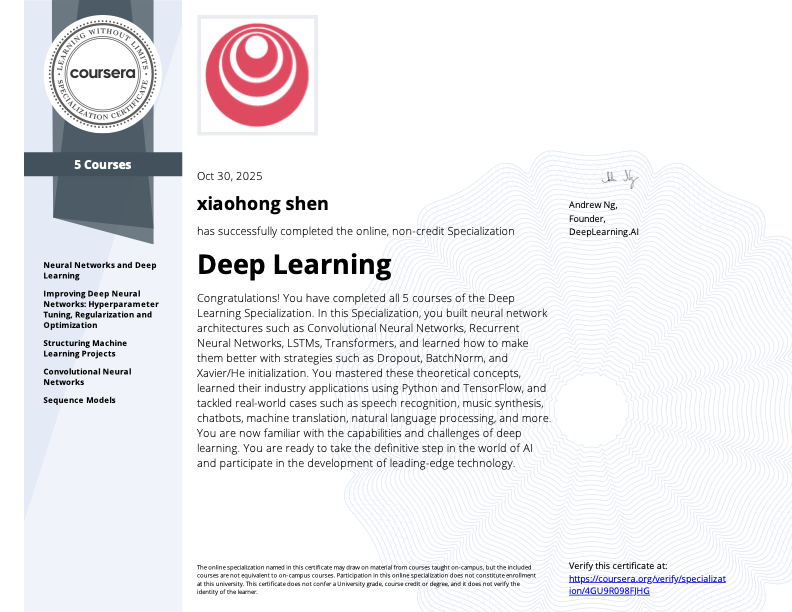

# My First Machine Learning Project
### **1. Brief Introduction**
  - I created this repository to share my journey and approach to learning machine learning
  and deep learning. It reflects my growing interest in these fields and the steps I've been taking to deepen my knowledge. I'm always open to connecting with others who are exploring similar topics
  —or to new opportunities where I can apply what I've learned.

### **2 Current Work: Deeply understand the deep learning core concept**
#### Neural Network from Scratch (NumPy)
- Implemented a **neural network from scratch using NumPy**.  
- Compared the same network implemented in **PyTorch Lightning**, ref [Notebook](NNFromScratch/np_nn_vs_lightning_nn.ipynb).

**Learned and applied:**
- Core principles of **forward and backward propagation**  
  - Implementation of **SGD and Adam optimizers**  
  - Understanding of **loss functions** and **gradient computation**  
  - Ability to **debug and verify neural network behavior** by comparison with PyTorch  
---
#### Convolutional Neural Network (PyTorch Lightning)
- Built a **CNN with modern techniques** for image classification, including **residual connections** and **batch normalization**.  
- **Trained and evaluated the CNN on CIFAR-10**, ref [Notebook](Image%20Classification%20Training%20Pipeline/EvaluationNotebook.ipynb).  

- **Overshooting / high variance problem:**
  - Initial accuracy (Train / Eval / Test): **0.99, 0.8852, 0.8827**  
  - Problem solved by:  
    1. Reducing the number of dense layers and units  
    2. Adding additional **dropout** in dense layers  
    3. Introducing more **data augmentations** (RandomRotation, ColorJitter)  
  - Final accuracy (Train / Eval / Test): **0.91, 0.89, 0.88**  

- Compared my CNN with **ResNet-18** trained on the same dataset:  
  - Accuracy (Train / Eval / Test): **0.985, 0.927, 0.919**  

**Learned and applied:**
- Modern CNN architectures (**Residual Connections**, **BatchNorm**)  
  - Data augmentation and regularization techniques to reduce overfitting  
  - Training strategies like **learning rate scheduling** and **early stopping**  
  - Model evaluation and performance comparison with standard architectures  

### **3 MLIrisDataSet**
  - This jupyter notebook uses the iris dataset for learning and practising typical ML algorithms of sample clustering and cataloguing
  - 1. Decision Tree with entropy measure
  - 2. As a, but the data are down sized with PCA 
	- Standarize data (mean = 0, std = 1)
	- Calculate the explained covariance by calling PCA with orginal number of features
	- Create a new data frame with reduced data dimension            - 
  - 3. KMeans (unsupervised learning) to clustering the data
  - 4. KNN(K-Nearest-Neighbors) 
  - 5. MeanShift (unsupervised learning)
  - 6. Build a MLP(Multi-Layer Perceptron) with 2 Dense layers
  - The method Decision Tree, KNN indicate the best results. The performance of the Decision Tree on the PCA processed data and MLP is little bit lower than the method a, d. The method c and e are unsupervised learning. In this way the performance of these are pretty poor.

### **4 AnomalyDetection**
  - 5 different methods for anomlay detection are implemented in this jupyter notebook.
    1) Calcuate the mean and standard deviation value, if some data are far away from the mean value
    2) Cluster data. Assume the 99% data are normal. Pick the 1% data which are at farthest away from the cluster central are otlier
                - Use KMeans and ellow method to find out the suitable number of culsters,
                - Use PCA(Principal component analysis) to reduce the data amount by calculating covariance, eigenvalue (eigenvactor is also caulcated but not used)
                - Use KMeans to cluster the dimension reduced dataset and calcuation the distance beteeen the data point and central of the related cluster the 1% data which at farthest to the cluster centra are anomaly
    3) Using IsolationForest method
    4) Oneclass SVM
    5) EllipticEnvelope for outlier detection of data set with gauss distribution, a very important condition for this method, the data set must be gauss distributed

### **5 CNN**
  - In the jupyter notebook, My1stCNN, a CNN model with 2 converluation layers are built. The model is trained to recognize cats or dogs on the fotos.
     1. Inputlayer with preprocessing (rescaling, resizing)
     2. 1st Converlution layer 
	 3. Maxpooling layer
	 4. 2nd Converlution layer
     5. Maxpooling layer
     6. Flatten layer
     7. Dense layer with Relu
     8. Output layer with sigmoid
  -  In the EvaMy1stCnn the created CNN model is evaluated with test data set and fotos from internet.

### **6 RNN**
  - A recurrent neural net is buit to forecast the apple stock price. In deed no body is able to get it. This is just an exercise to learn and understand the RNN. Pls don't take it seriously.
     1. Each data frame consists of close price of 20 days, the close price of 21th day shall be forecasted
     2. The RNN (input layer with input size = 20 -> dense layer with 5 neurone -> output layer with output size = 1
     3. On going ... test different ideal
  - The plot shows obviously that the forcasted price is always behind the real price development, especially when the stock price trend changes

### **7 Exercise**
  - Coding examples with some essential machine learning algorithms
    - inear regression
    - Logistic regression
    - KMeans clsuter
    - KNN
    - MeanShift
  - **Learning Pytorch** (LearningPytorch.ipynb)
      - Try out some pytorch tensor methods, e.g. torch.randn, torch.tensor.unfold, tensor_split.
      - Learning Pytroch Lightning data preparing
        - Try out **Sampler methods to (random) sort and batch datasets
        - Try out Dataloader method with a new created sub class of Dataset to load/iterate datasets, which is feed in the same way to the method training_step defined by the pytorch Lightning 
        - Try out the methods pad_sequence and pack_padded_sequence ect. These methods are required by rnn and derivatives nets like LSTM to keep the train datasets having same length.

